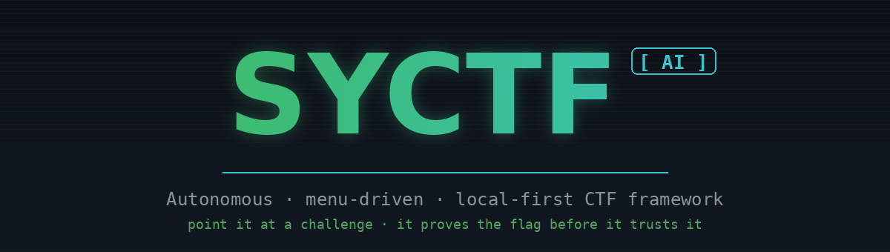
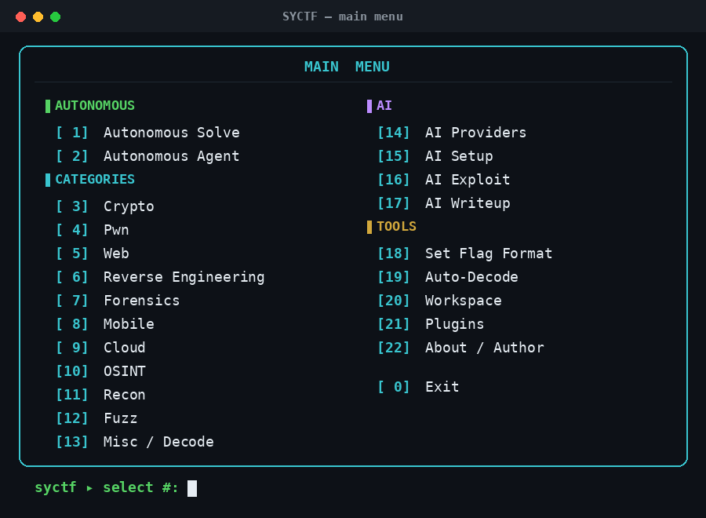
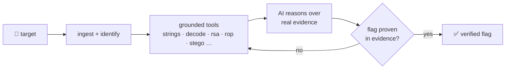

<div align="center">



[](https://www.python.org/downloads/)
[](LICENSE)
[](https://github.com/SYCO7/SYCTF/actions/workflows/ci.yml)
[](docs/ai/models.md)
[](CHANGELOG.md)


</div>

---

## ⚡ Install (Linux / Kali)

```bash
git clone https://github.com/SYCO7/SYCTF.git && cd SYCTF
python3 -m venv ctfvenv && source ctfvenv/bin/activate
pip install -r requirements.txt
pip install .                 # installs the `syctf` command on your PATH
syctf                         # launch the menu   (no install? use: python -m syctf)
```

<sub><b>Troubleshooting</b> — Kali <code>externally-managed-environment</code>: you're not inside a venv; run the <code>python3 -m venv</code> + <code>source</code> lines first. A leftover <code>ctfvenv</code> from another OS (has <code>Scripts/</code> or a <code>C:\</code> path) is broken on Linux → <code>rm -rf ctfvenv</code> and recreate. Typing <code>syctf</code> does nothing → you skipped <code>pip install .</code> (use <code>python -m syctf</code> meanwhile).</sub>

Docker: `docker build -t syctf . && docker run --rm -it syctf`

---

## ▶ Use it — just pick a number

Run `syctf` (no arguments) and the menu opens:

<div align="center">

</div>

You set the **flag format** once at the start of a challenge (menu → *Set Flag
Format*, or `--flag-format picoCTF{}`) and every module uses it.

Pick a category → pick a module → it prompts for each argument → runs. Everything is also a direct command:

```bash
syctf solve "ZmxhZ3toaX0="                 # autonomous solve (auto-detects type)
syctf agent ./chal --goal "get the flag"   # AI drives real modules to the flag
syctf arena ./ctf_folder --flag-format picoCTF{}   # batch-solve a whole event → scoreboard
syctf crypto-helper rsa-attacks --n 0x.. --e 65537 --c 0x..
syctf forensics stegano --file cat.png
```

Full walkthrough with ready-made sample challenges → [`docs/DEMO.md`](docs/DEMO.md).

---

## 🧠 How it works



- **Grounded first** — deterministic tools extract real evidence *before* any token is spent.
- **Any AI** — local Ollama by default, or Claude / OpenAI / Gemini / Groq / NVIDIA … bring a key, local fallback is automatic.
- **Honest by design** — a flag is accepted only if it literally appears in tool output (never guessed). **Planted decoys** (`fake`, `try_harder`, `not_the_real…`) are recognised and skipped, so SYCTF keeps looking for the real one. Absolute certainty? point it at an oracle — a published hash or a checker — via `verify_flag`.
- **`agent` mode** — the LLM picks and runs the *actual* SYCTF modules in a loop, not just built-ins.

> **vs. other AI solvers** (PentestGPT · EnIGMA · CAI …): those are cloud-LLM,
> single-vendor, and trust the model's answer. SYCTF is **local-first**,
> **any-provider**, **menu-driven**, and **won't report a flag it can't prove** —
> decoys and hallucinations are rejected, not submitted.

---

## 🧩 What's inside

| | Categories |
|---|---|
| **Crypto** | RSA (factordb/Fermat/Wiener/low-exp), XOR, decode, hashes |
| **Pwn** | ROP gadgets, format-string writes, ELF triage, offsets |
| **Web** | SQLi, XSS, LFI, JWT (alg=none / crack) |
| **Forensics** | LSB stego, zip-crack, pcap extraction |
| **Mobile** | APK manifest (AXML), secrets, DEX strings |
| **Cloud** | S3 enum, IMDS-SSRF, cloud-key scan |
| **OSINT** | subdomains, DNS, RDAP whois, wayback, username-enum |
| **Core** | recon · fuzz · rev · misc · 17-provider AI · plugins |

Self-contained: pure-Python (even the PNG decoder & binary-AXML parser) — no heavy external tools required.

---

## 🔌 Bring any AI

```bash
export ANTHROPIC_API_KEY=sk-...
SYCTF_AI_PROVIDER=anthropic syctf agent ./chal
```

`syctf ai providers` lists all 17 backends and what's configured. Best local models for an 8–12 GB Kali box → [`docs/ai/models.md`](docs/ai/models.md).

---

## 👤 Author

**Tanmoy Mondal**
[GitHub](https://github.com/SYCO7) · [LinkedIn](https://www.linkedin.com/in/tanmoy-mondal-11070334b/) · [Portfolio](https://cybersyco.vercel.app/)

<sub>MIT licensed · for CTFs, education, and authorized security research only.</sub>
