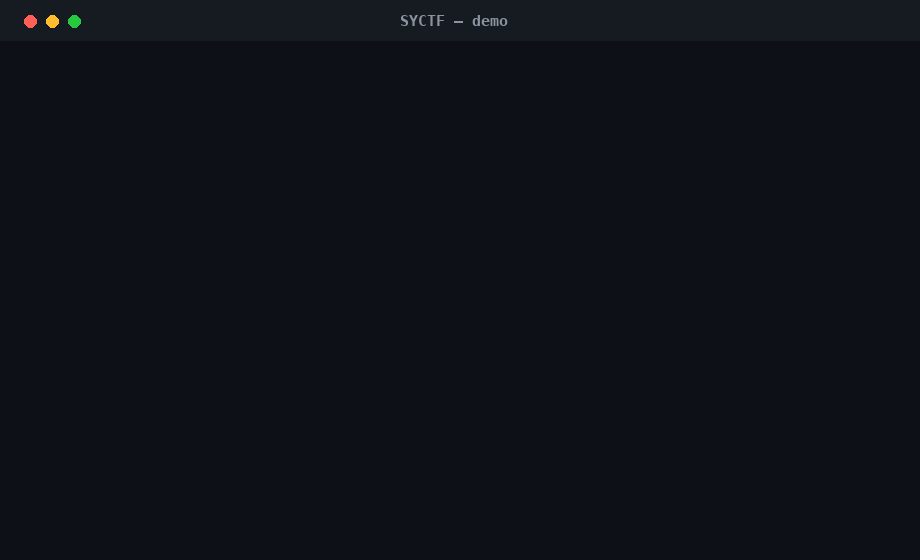
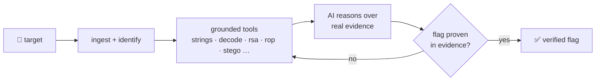

<div align="center">

<pre>
  ███████╗██╗   ██╗ ██████╗████████╗███████╗   [AI]
  ██╔════╝╚██╗ ██╔╝██╔════╝╚══██╔══╝██╔════╝
  ███████╗ ╚████╔╝ ██║        ██║   █████╗
  ╚════██║  ╚██╔╝  ██║        ██║   ██╔══╝
  ███████║   ██║   ╚██████╗   ██║   ██║
  ╚══════╝   ╚═╝    ╚═════╝   ╚═╝   ╚═╝
</pre>

### Autonomous · menu-driven · local-first CTF framework

*Point it at a challenge. It thinks with any AI, uses real tools, and only trusts a flag it can prove.*

[](https://www.python.org/downloads/)
[](LICENSE)
[](https://github.com/SYCO7/SYCTF/actions/workflows/ci.yml)
[](docs/ai/models.md)
[](CHANGELOG.md)



</div>

---

## ⚡ Install

```bash
git clone https://github.com/SYCO7/SYCTF.git && cd SYCTF
python3 -m venv ctfvenv && source ctfvenv/bin/activate
pip install -r requirements.txt
python -m syctf            # or: pip install . && syctf
```

Docker: `docker build -t syctf . && docker run --rm -it syctf`

---

## ▶ Use it — just pick a number

Run `syctf` (no arguments) and the menu opens:

```text
╭──────────────── MAIN MENU ────────────────╮
│  [1] 🎯 Autonomous Solve                   │
│  [2] 🤖 Autonomous Agent                   │
│  [3] 🔐 Crypto   [4] 💥 Pwn   [5] 🌐 Web   │
│  [6] 🧩 Rev  [7] 🕵️ Forensics  [8] 📱 Mobile│
│  [9] ☁️ Cloud   [10] 🔎 OSINT              │
│ [11] 📡 Recon … [15] 🧠 AI Providers       │
│  [0] 🚪 Exit                               │
╰────────────────────────────────────────────╯
syctf ▸ select #:
```

Pick a category → pick a module → it prompts for each argument → runs. Everything is also a direct command:

```bash
syctf solve "ZmxhZ3toaX0="                 # autonomous solve (auto-detects type)
syctf agent ./chal --goal "get the flag"   # AI drives real modules to the flag
syctf crypto-helper rsa-attacks --n 0x.. --e 65537 --c 0x..
syctf forensics stegano --file cat.png
```

---

## 🧠 How it works



- **Grounded first** — deterministic tools extract real evidence *before* any token is spent.
- **Any AI** — local Ollama by default, or Claude / OpenAI / Gemini / Groq / NVIDIA … bring a key, local fallback is automatic.
- **Honest by design** — a claimed flag is accepted only if it literally appears in tool output. Hallucinated flags are rejected and logged, then fed back as negative examples.
- **`agent` mode** — the LLM picks and runs the *actual* SYCTF modules in a loop, not just built-ins.

---

## 🧩 What's inside

| | Categories |
|---|---|
| **Crypto** | RSA (factordb/Fermat/Wiener/low-exp), XOR, decode, hashes |
| **Pwn** | ROP gadgets, format-string writes, ELF triage, offsets |
| **Web** | SQLi, XSS, LFI, JWT (alg=none / crack) |
| **Forensics** | LSB stego, zip-crack, pcap extraction |
| **Mobile** | APK manifest (AXML), secrets, DEX strings |
| **Cloud** | S3 enum, IMDS-SSRF, cloud-key scan |
| **OSINT** | subdomains, DNS, RDAP whois, wayback, username-enum |
| **Core** | recon · fuzz · rev · misc · 17-provider AI · plugins |

Self-contained: pure-Python (even the PNG decoder & binary-AXML parser) — no heavy external tools required.

---

## 🔌 Bring any AI

```bash
export ANTHROPIC_API_KEY=sk-...
SYCTF_AI_PROVIDER=anthropic syctf agent ./chal
```

`syctf ai providers` lists all 17 backends and what's configured. Best local models for an 8–12 GB Kali box → [`docs/ai/models.md`](docs/ai/models.md).

---

## 👤 Author

**Tanmoy Mondal**
[GitHub](https://github.com/SYCO7) · [LinkedIn](https://www.linkedin.com/in/tanmoy-mondal-11070334b/) · [Portfolio](https://cybersyco.vercel.app/)

<sub>MIT licensed · for CTFs, education, and authorized security research only.</sub>
